# MySQL-DataCleaning-EDA

# 📂 MySQL Layoff Analysis Project

[EDA Process](#-MySQL-EDA-Process-Logs) | [Layoff Insights (2020-2023)](#layoff-insights-2020-2023)
# MySQL Data Cleaning – Process Logs

This project demonstrates an **end-to-end workflow** in MySQL: from raw data import, through cleaning, to exploratory analysis (EDA).  
Below are the documented steps, each linked with supporting images.

---

## 📌 Project Steps

1. **Open MySQL, connect to server**  

2. **Create new schema** – named `world_layoffs`  
   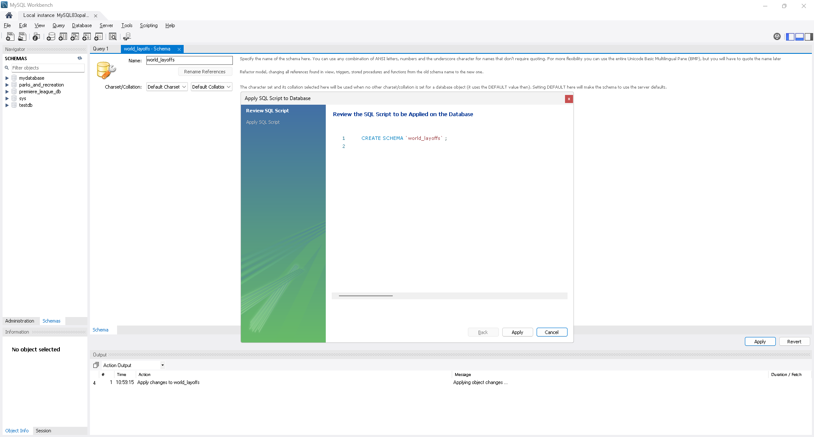

3. **Import data**  
   - `world_layoffs` → Table Data Import Wizard  
   - Create new table, correct data types (kept raw for this project)  
   - Refresh schema after finishing  
   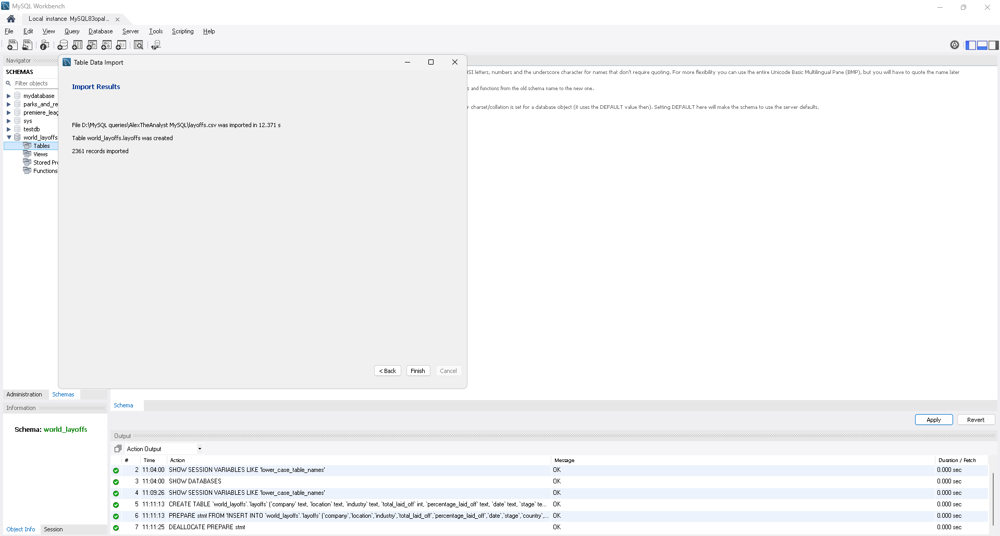

4. **List cleaning plan**  
   - Remove duplicates  
   - Standardize data  
   - Handle NULL/blank values  
   - Remove unnecessary columns  
   
5. **Create staging table** – `layoffs_staging` for raw data before cleaning  

6. **Insert data** from `layoffs` into `layoffs_staging`  
   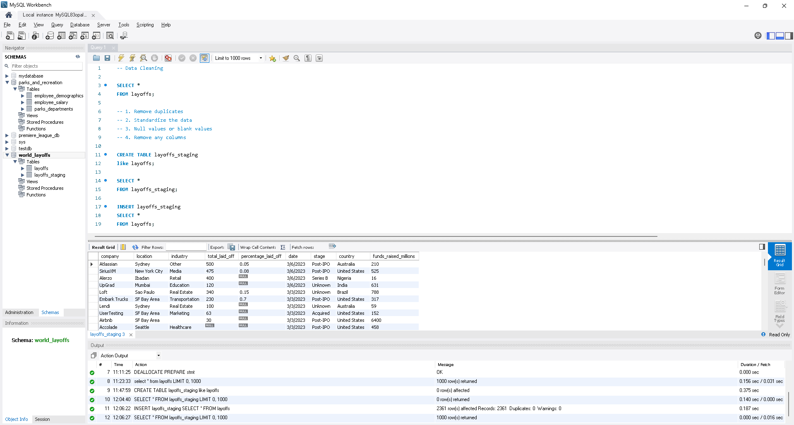

7. **Work only with staging table** (`layoffs_staging`) for best practice  

8. **Remove duplicate rows**  
   - Create CTEs  
   - Create `layoffs_staging2`  
   - Insert CTE results into `layoffs_staging2`  
   - Delete duplicates (safe mode off)  

   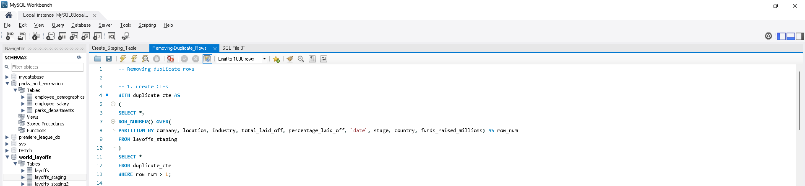  
   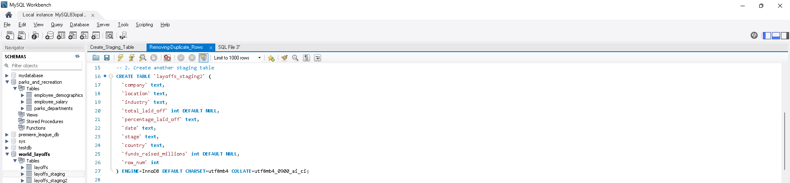  
   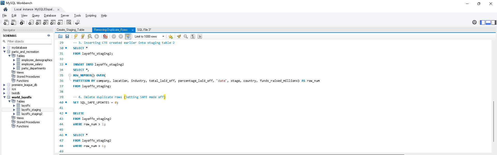

9. **Standardize data**  
   - Use `TRIM()`  
   - Merge similar values into consistent categories  
   - Change data types (e.g., `date` column → DATE type)  

   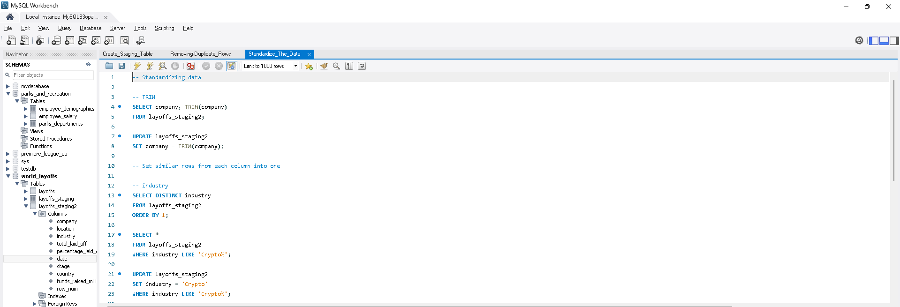  
   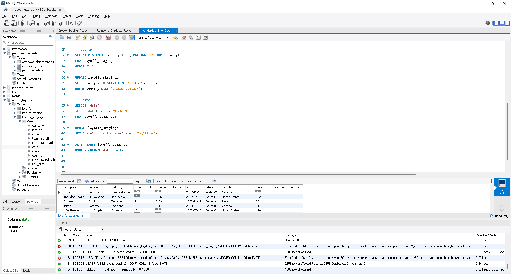

10. **Handle NULL/blank values**  
    - Update or remove based on context
      
    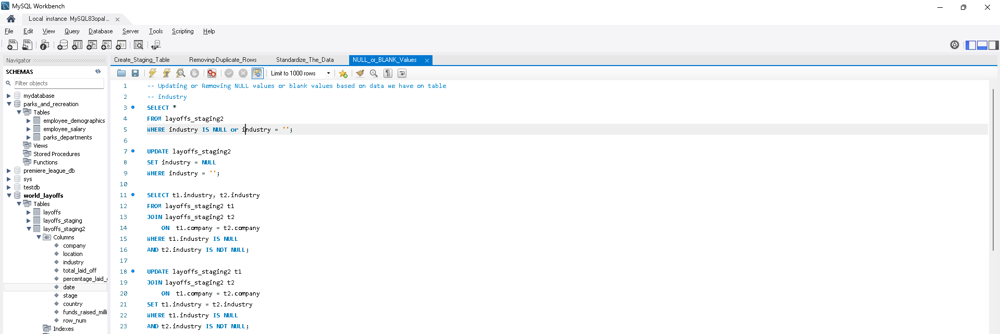  
    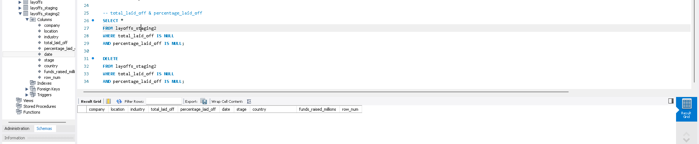

11. **Remove temporary columns** used during cleaning  
    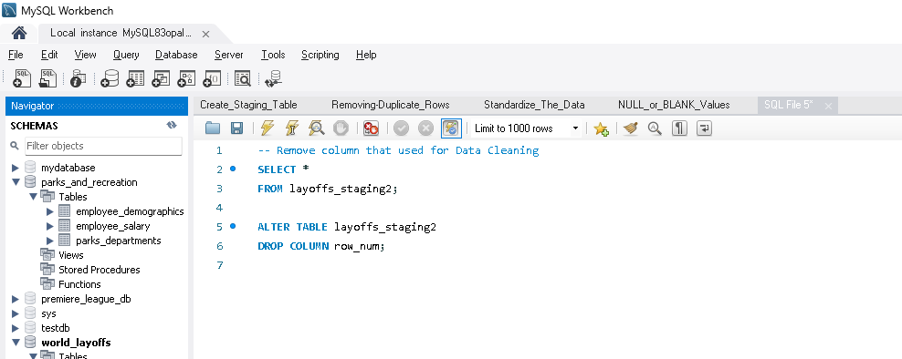

---

## ✅ Outcome
✅ Cleaned dataset ready for EDA.  
📂 Documented SQL scripts in [data_cleaning/scripts](data_cleaning/scripts)  
🖼️ Screenshots and workflow images in [assets/data-cleaning-images](assets/data-cleaning-images)

## 📝 MySQL EDA Process Logs

1. Using CTEs for company with most laid off employees (2020–2023, Top 5)  
   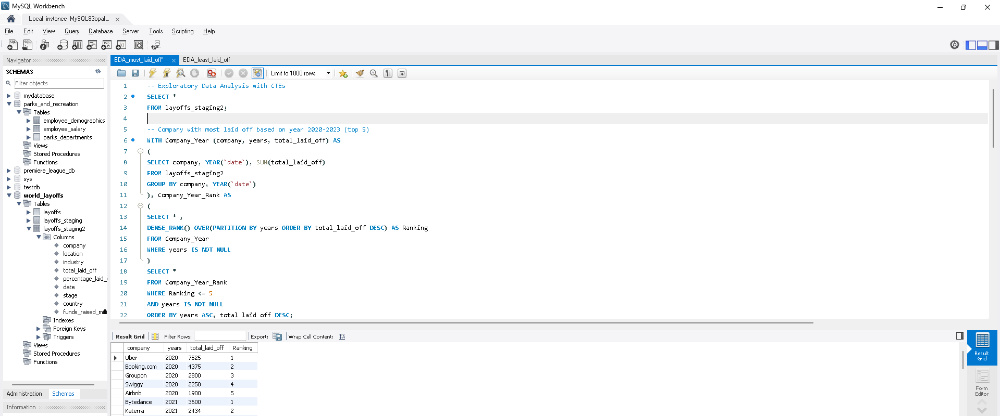

2. Using CTEs for industry with most laid off employees (2020–2023, Top 5)  
   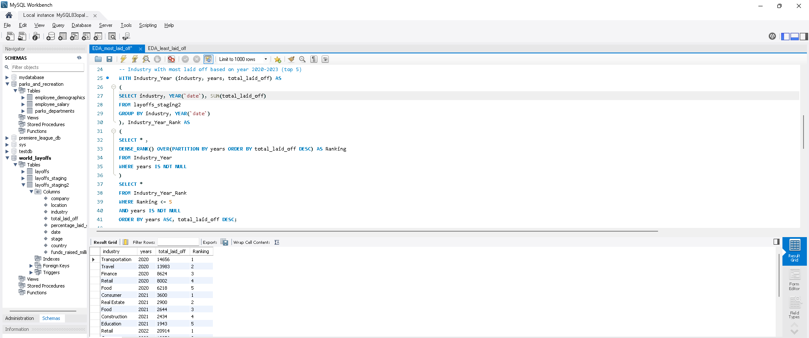

3. Using CTEs for country with most laid off employees (2020–2023, Top 5)  
   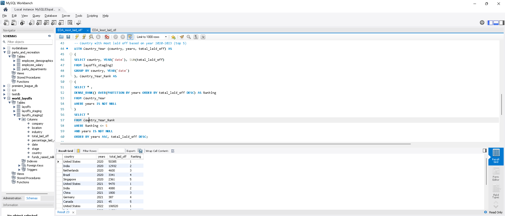

4. Using CTEs for location with most laid off employees (2020–2023, Top 5)  
   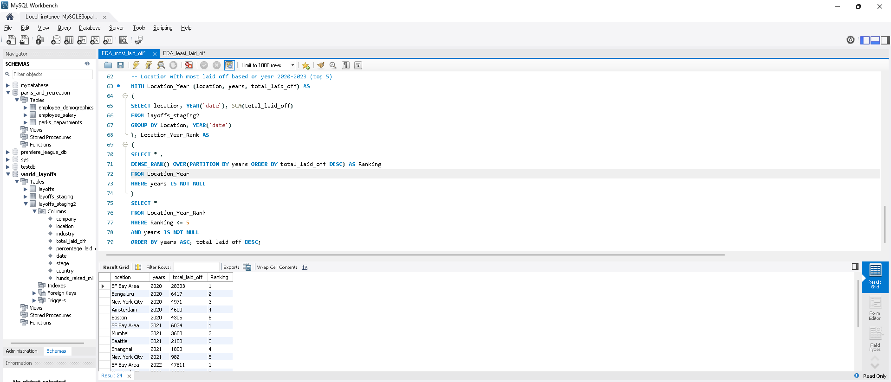

5. Using CTEs for industry with least laid off employees (2020–2023, Bottom 5)  
   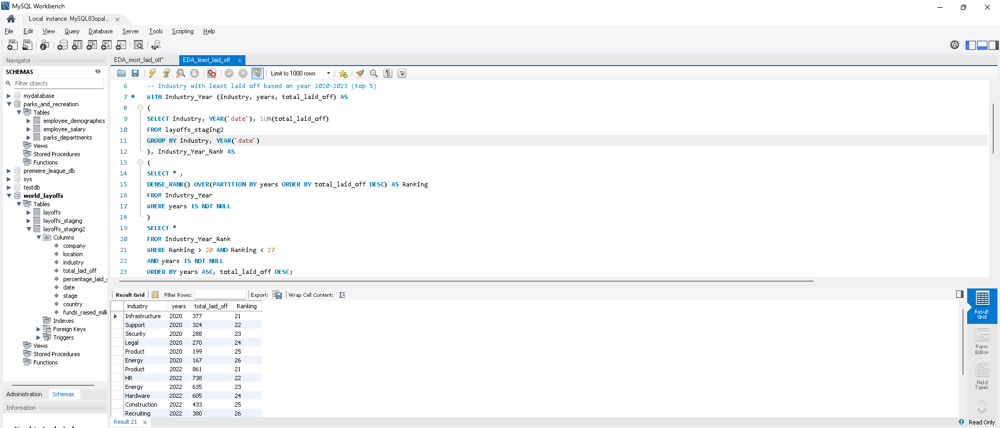

6. Using CTEs for country with least laid off employees (2020–2023, Bottom 5)  
   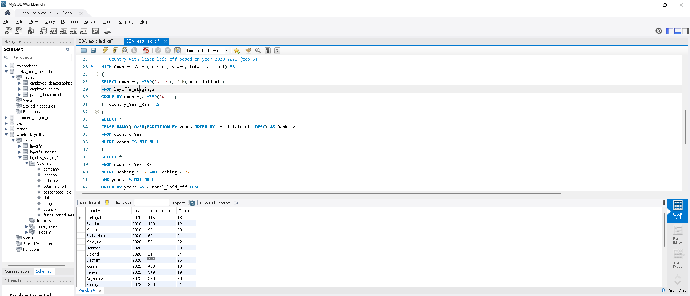

7. Using CTEs for location with least laid off employees (2020–2023, Bottom 5)  
   

## ✅ Outcome ✅ Cleaned dataset analyzed with EDA queries. 
📂 Documented SQL scripts in [eda/scripts](EDA/scripts) 
🖼️ Visualizations and process logs in [assets/data-EDA-images](assets/data-EDA-images)

## Layoff Insights 2020–2023

### 📈 Most Layoffs Insights
1. **Companies**
- 2020 → Uber, Booking.com, Groupon, Swiggy, Airbnb  
- 2021 → Bytedance, Katerra, Zillow, Instacart, WhiteHat Jr  
- 2022 → Meta, Amazon, Cisco, Peloton, Carvana, Philips  
- 2023 → Google, Microsoft, Ericsson, Amazon, Salesforce, Dell  
➝ Layoffs shifted from pandemic‑hit travel firms in 2020 to startups in 2021, then to Big Tech giants in 2022–2023.

2. **Industries**
- 2020 → Transportation, Travel, Finance, Retail, Food  
- 2021 → Consumer, Real Estate, Food, Construction, Education  
- 2022 → Retail, Consumer, Transportation, Healthcare, Finance  
- 2023 → Other, Consumer, Retail, Hardware, Healthcare  
➝ Early layoffs concentrated in pandemic‑sensitive sectors, later years saw consumer, retail, and tech restructuring dominate.

3. **Countries**
- 2020 → United States, India, Netherlands, Brazil, Singapore  
- 2021 → United States, India, China, Germany, Canada  
- 2022 → United States, India, Netherlands, Brazil, Canada  
- 2023 → United States, Sweden, Netherlands, India, Germany  
➝ The United States consistently led layoffs, with India and European hubs appearing repeatedly.

4. **Locations**
- 2020 → SF Bay Area, Bengaluru, New York City, Amsterdam, Boston  
- 2021 → SF Bay Area, Mumbai, Seattle, Shanghai, New York City  
- 2022 → SF Bay Area, New York City, Seattle, Bengaluru, Amsterdam  
- 2023 → SF Bay Area, Seattle, Stockholm, Amsterdam, New York City  
➝ Layoffs were concentrated in major innovation hubs, especially the SF Bay Area, with recurring impacts in NYC, Seattle, Bengaluru, and Amsterdam.

**Overall:** The largest layoffs moved from pandemic‑sensitive industries and travel firms (2020) → startup instability (2021) → Big Tech corrections (2022–2023), centered around the US and global tech hubs.

---

### 📉 Least Layoffs Insights
5. **Industries**
- 2020 → Infrastructure, Support, Security, Legal, Product, Energy  
- 2022 → Product, HR, Energy, Hardware, Construction, Recruiting  
- 2023 → Infrastructure, Legal, Product, Construction, Fitness, Manufacturing  
➝ These sectors represent supporting and specialized functions that remained relatively stable compared to customer‑facing or growth‑driven industries.

6. **Countries**
- 2020 → Portugal, Sweden, Mexico, Switzerland, Malaysia, Denmark, Ireland  
- 2022 → Russia, Kenya, Argentina, Senegal, Finland, Ireland, Denmark, Mexico, Estonia, Singapore  
- 2023 → Ireland  
➝ Layoffs were consistently lower in smaller or diversified economies, reflecting limited exposure to global tech shocks compared to the US and India.

7. **Locations**
- 2020 → Dubai, Ahmedabad, Washington D.C., Las Vegas, Denver, Lagos  
- 2022 → San Diego, Atlanta, Mumbai, Ottawa, Vancouver, Detroit  
- 2023 → Los Angeles, Phoenix, Montreal, Oxford, Atlanta, Paris  
➝ Layoffs were fewer in secondary cities and regional hubs, showing geographic resilience outside core innovation centers like SF Bay Area or New York.

**Overall:** The least layoffs were found in support functions, smaller economies, and secondary cities, highlighting areas of resilience and stability during global disruption.
